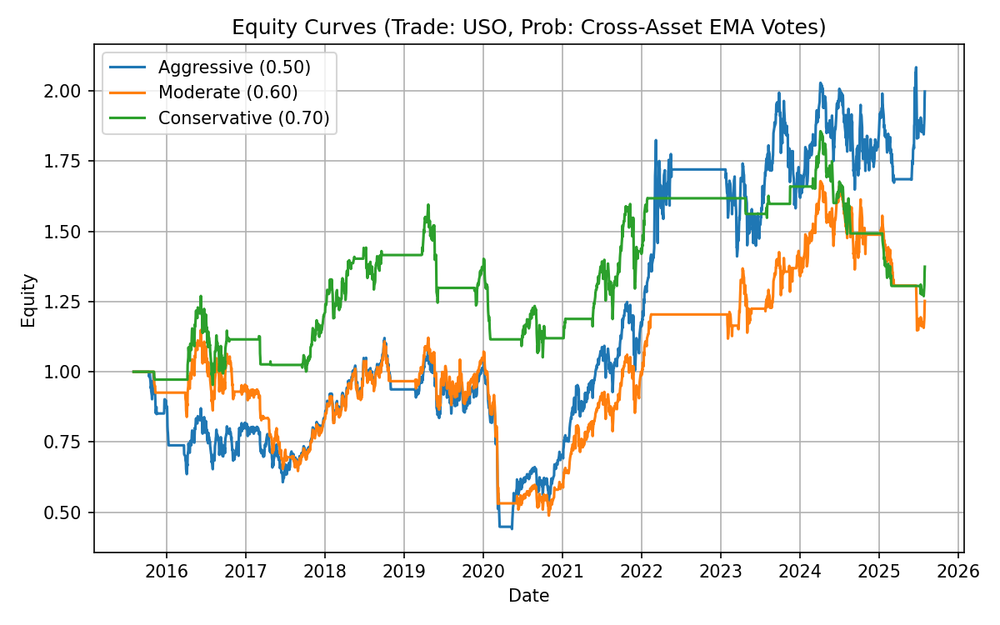
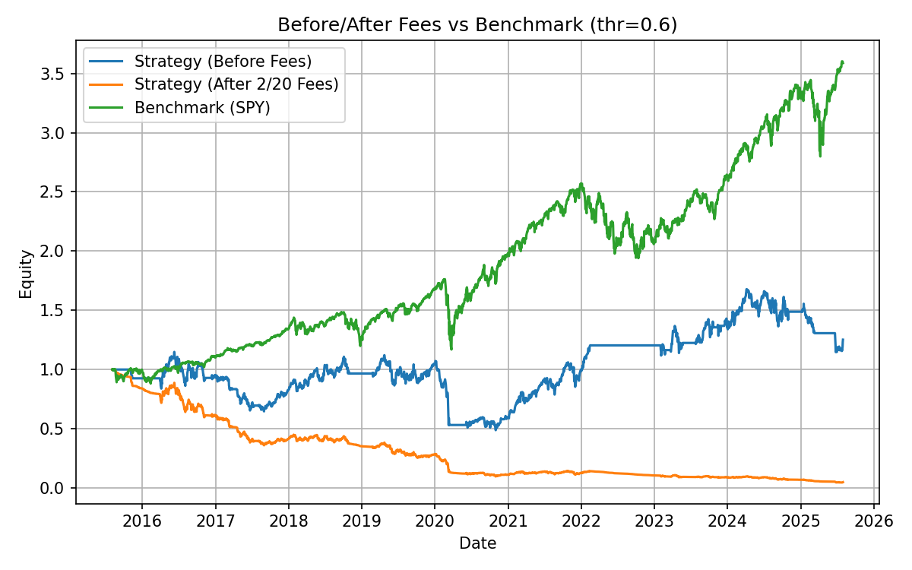
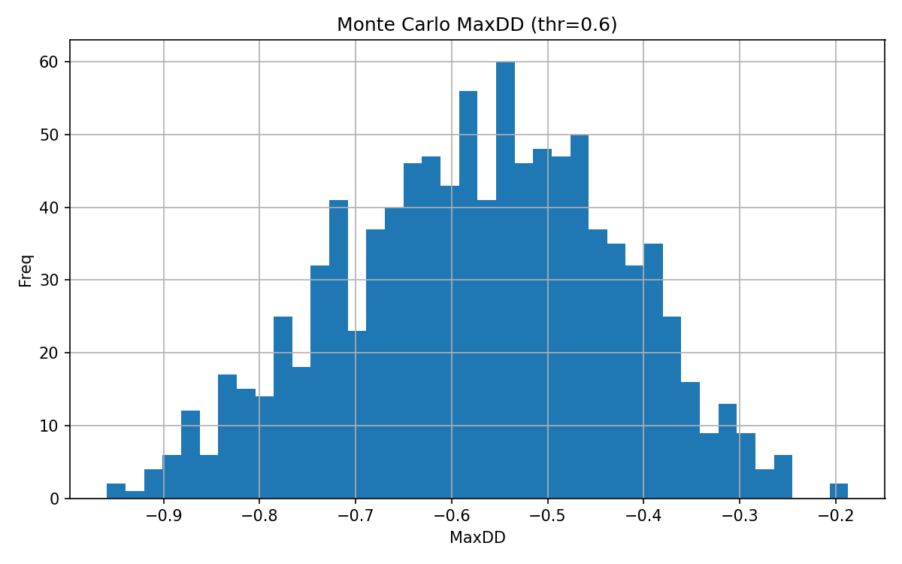
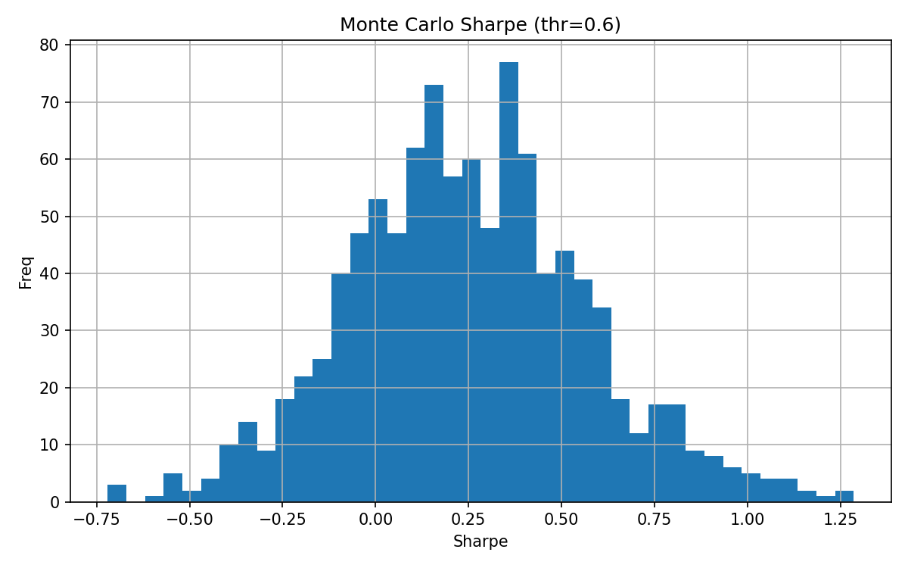

# Algorithmic Trading with Cross-Asset Momentum Signals  

## Overview  
This repository contains the term project for MSDS 451, focusing on algorithmic trading using cross-asset momentum signals. The project explores whether simple exponential moving average (EMA) rules applied to multiple ETFs can generate profitable trading signals for the United States Oil Fund (USO).  

The research demonstrates the performance of Aggressive, Moderate, and Conservative strategies under different probability thresholds and evaluates their viability under realistic hedge fund fee structures.  

---

## Repository Structure  
```
.
├── Outputs/                            # Model outputs and performance files
│   ├── after_fees_equity_5ETF.png      # Equity curves before and after hedge fund fees
│   ├── after_fees_metrics_5ETF.txt     # Performance metrics summary (CAGR, Sharpe, MaxDD, etc.)
│   ├── core_series.csv                 # Core input time series (USO + signal ETFs)
│   ├── equity_curves_5ETF.png          # Equity curves for Aggressive, Moderate, Conservative strategies
│   ├── mc_drawdown_hist_5ETF.png       # Monte Carlo distribution of maximum drawdowns
│   ├── mc_sharpe_hist_5ETF.png         # Monte Carlo distribution of Sharpe ratios
│   ├── mc_summary_5ETF.csv             # Monte Carlo summary statistics
│
├── Report/                             # Written report and supporting documentation
│
├── Final Project Pipeline.ipynb        # Main Jupyter Notebook with code pipeline
├── README.md                           # Project documentation
```

---

## Data  
Daily price data from 2015–2025 were downloaded from **Yahoo Finance** using the Python `yfinance` library.  

- **Tradable instrument:** USO (United States Oil Fund, proxy for WTI crude oil)  
- **Signal ETFs:**  
  - SPY (U.S. equities, benchmark)  
  - GLD (gold)  
  - TLT (long-term Treasuries)  
  - VGT (technology sector)  

---

## Methods  
1. **Signal Construction**  
   - Compute 40-day and 80-day exponential moving averages (EMA) for each ETF.  
   - If 40-day EMA > 80-day EMA, assign an “uptrend” vote of 1; otherwise 0.  
   - Aggregate votes across ETFs to form a probability score.  

2. **Trading Rules**  
   - Aggressive (threshold 0.50): enter long if ≥50% of signals are positive.  
   - Moderate (threshold 0.60): require stronger cross-asset confirmation.  
   - Conservative (threshold 0.70): require near-unanimous agreement.  
   - Stay in cash otherwise.  

3. **Evaluation Metrics**  
   - Compound annual growth rate (CAGR)  
   - Sharpe ratio  
   - Maximum drawdown (MaxDD)  
   - Win rate  
   - Monte Carlo robustness checks (1,000 block bootstrap resamples)  
   - Hedge fund “2 and 20” fee adjustment  

---

## Results  

- **Equity Curves**  
 
Aggressive shows the strongest growth but deepest drawdowns; Conservative sacrifices returns for stability.  

- **After-Fee Performance**  
  
Under the 2/20 hedge fund fee structure, the strategy becomes unprofitable compared to SPY.  

- **Monte Carlo Robustness**  
  
  
Simulations show that most Sharpe ratios fall between 0.2–0.5 and drawdowns between –50% and –70%.  

- **Performance Summary**  
See [after_fees_metrics_5ETF.txt](Outputs/after_fees_metrics_5ETF.txt) for details.  
After applying hedge fund fees, CAGR = –26.17%, Sharpe = –1.11, MaxDD = –95.41%.  

---

## Management Recommendation  
The strategy is not commercially viable as a hedge fund because modest raw returns are fully eroded by standard fees. However, it may be explored as:  

- A **low-cost ETF prototype** (without hedge fund fees).  
- A **research tool** to study cross-asset momentum and robustness in commodity markets.  

From a personal perspective, I would not recommend launching this as a hedge fund, but I see value in continuing research and refining the model.  

---

## GenAI Tools  
This project made use of **ChatGPT (OpenAI GPT-5)** for support in:  
- Drafting the research report and README  
- Refining Python scripts  
  

---

## References  
Antonacci, Gary. 2014. *Dual Momentum Investing: An Innovative Strategy for Higher Returns with Lower Risk.* McGraw Hill.  
Bouchouev, Ilia. 2023. *Virtual Barrels: Quantitative Trading in the Oil Market.* Springer.  
Carver, Robert. 2015. *Systematic Trading: A Unique New Method for Designing Trading and Investing Systems.* Harriman House.  
Clenow, Andreas. 2019. *Trading Evolved: Anyone Can Build Killer Trading Strategies in Python.* Independently Published.  
Covel, Michael. 2017. *Trend Following: How to Make a Fortune in Bull, Bear and Black Swan Markets.* Wiley.  
Jegadeesh, Narasimhan, and Sheridan Titman. 1993. “Returns to Buying Winners and Selling Losers.” *Journal of Finance* 48 (1): 65–91.  
Lo, Andrew W. 2017. *Adaptive Markets: Financial Evolution at the Speed of Thought.* Princeton University Press.  
López de Prado, Marcos. 2018. *Advances in Financial Machine Learning.* Wiley.  
Malkiel, Burton G. 2023. *A Random Walk Down Wall Street.* 13th ed. Norton.  
